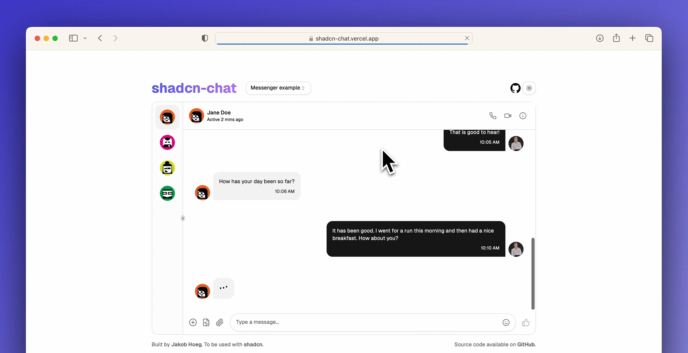

[](https://shadcn-chat.vercel.app/)

<h1 align="center">shadcn-chat</h1>
<div align="center">
   
   
   
</div>


<p align="center">Customizable and re-usable chat component for you to use in your projects. Built on top of shadcn.</p>

<div align="center">

[Demo](https://shadcn-chat.vercel.app/) • [Preview](#Preview) • [Usage](#Usage) • [Installation](#Installation) • [Tech stack](#Tech-stack) 

</div>

# Preview

https://github.com/jakobhoeg/shadcn-chat/assets/114422072/a934f80f-1662-46f2-83bc-bdca45982ce6

# Usage

You can use the source code and copy paste components into your NextJS project. 

These components in particular:

```
/src/app/components/chat/chat-layout.tsx, chat.tsx, chat-topbar.tsx, chat-list.tsx & chat-bottombar.tsx
```

# Installation

If you'd like to spin up a local environment similar to the [demo](https://shadcn-chat.vercel.app/), follow these instructions:

**1. Clone the repository to a directory on your pc via command prompt:**
   
```
git clone https://github.com/jakobhoeg/shadcn-chat
```

**2. Open the folder:**

```
cd shadcn-chat
```
   
**3. Install dependencies:**

```
npm install
```

**4. Start the development server:**

```
npm run dev
```

**5. Go to [localhost](http://localhost:3000) and start playing around!**

# Tech stack

[NextJS](https://nextjs.org/) - React Framework for the Web

[TailwindCSS](https://tailwindcss.com/) - Utility-first CSS framework

[shadcn-ui](https://ui.shadcn.com/) - UI component built using Radix UI and Tailwind CSS

[Emoji Mart](https://github.com/missive/emoji-mart) - Customizable emoji picker for the web

[Framer Motion](https://www.framer.com/motion/) - Motion/animation library for React

[Lucide Icons](https://lucide.dev/) - Icon library
